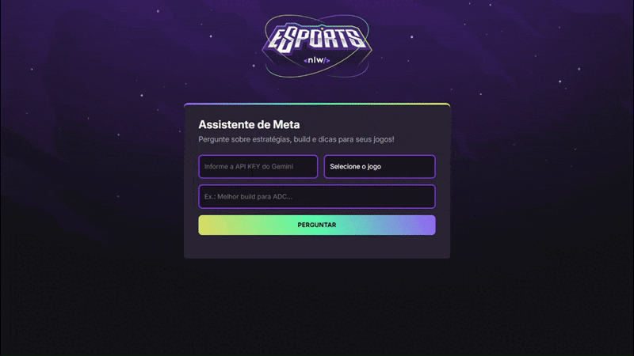

<p align="center">
  
</p>

<h1 align="center">🎮 Assistente de IA para Gamers</h1>

<p align="center">
  
  
</p>

> Seu melhor amigo na busca de estratégias, dicas e informações sobre o seu game favorito! Este projeto integra a IA do Google Gemini para fornecer respostas rápidas e precisas sobre o universo dos games.

## 📋 Índice

- [Sobre o Projeto](#-sobre-o-projeto)
- [Funcionalidades](#-funcionalidades)
- [Tecnologias Utilizadas](#-tecnologias-utilizadas)
- [Como Executar](#-como-executar)
- [Engenharia de Prompt](#-engenharia-de-prompt)
- [Licença](#-licença)
- [Agradecimentos](#-agradecimentos)

## 🚀 Sobre o Projeto

A ideia foi criar um **Assitente de IA para Gamers**, que forneça informações em tempo real em relação a personagens, versões de _patch_, _builds_, estratégias e dicas sobre um determinado jogo.

Este projeto foi desenvolvido como parte do evento **NLW (Next Level Week) Agents**, na trilha Iniciante, promovido pela [Rocketseat](https://www.rocketseat.com.br/) e ministrado pelo professor [Mayk Brito](https://github.com/maykbrito). O desafio era integrar **Inteligência Artificial** a um projeto existente, neste caso, a interface do NLW eSports.

## ✨ Funcionalidades

-   **Conexão Segura:** O usuário fornece sua própria chave de API do Google Gemini, garantindo que o uso seja privado.
-   **Seleção de Jogo:** Permite escolher o jogo sobre o qual a pergunta será feita, fornecendo um contexto específico para a IA.
-   **Respostas Inteligentes:** Utiliza a IA do Gemini para buscar e formatar respostas.
-   **Tratamento de Erros:** Informa ao usuário quando uma resposta não é encontrada ou se a pergunta foge do escopo de games.

## 🛠️ Tecnologias Utilizadas

O projeto foi construído com as seguintes tecnologias:

| Tecnologia | Descrição |
| :--- | :--- |
| **HTML5** | Estruturação e semântica do conteúdo. |
| **CSS3** | Estilização e design da interface. |
| **JavaScript** | Interatividade, manipulação do DOM e lógica da aplicação. |
| **Google Gemini e Google Source** | LLM Google Gemini utilizando a ferramenta Google Source, formando um Agente de IA, capaz de processar as perguntas, fazer pesquisas e gerar as respostas. |

## 🏁 Como Executar

Para executar este projeto localmente, siga os passos abaixo:

1.  **Clone o repositório:**
    ```bash
    # Clone o repositório localmente
    git clone https://github.com/miguelmachadofs/nlw-agents.git

    # Navegue até a pasta do repositório
    cd seu-repositorio

    # Abra o Explorador de Arquivos na pasta do repositório clonado (através deste comando ou manualmente)
    explorer.exe .
    ```

2.  **Abra o arquivo `index.html` no seu navegador.**
    -   Por ser um projeto front-end puro, não é necessário um servidor. Basta abrir o arquivo diretamente.

3.  **Obtenha sua API Key do Gemini:**
    -   Acesse o Google AI Studio.
    -   Clique em "Get API key" e crie uma nova chave.

4.  **Insira sua API Key na aplicação** e comece a fazer suas perguntas!

## 🧠 Engenharia de Prompt

Para garantir que o assistente fornecesse respostas úteis e coerentes, foi aplicada a **Engenharia de Prompt**. As regras definidas no prompt orientam a IA do Gemini a:

-   Atuar como um especialista em games.
-   Fornecer respostas concisas e diretas.
-   Manter o foco estritamente em informações sobre jogos.
-   Recusar-se a responder perguntas fora de contexto, evitando "delírios" ou informações incorretas.

O objetivo é simular um assistente rápido e eficiente, ideal para gamers que precisam de informações em tempo real durante suas partidas.

## 📄 Licença

Este projeto está sob a licença MIT.

## 🙏 Agradecimentos

-   À **Rocketseat** pela iniciativa do evento NLW.
-   Ao professor **Mayk Brito** pelas aulas e pela didática.

